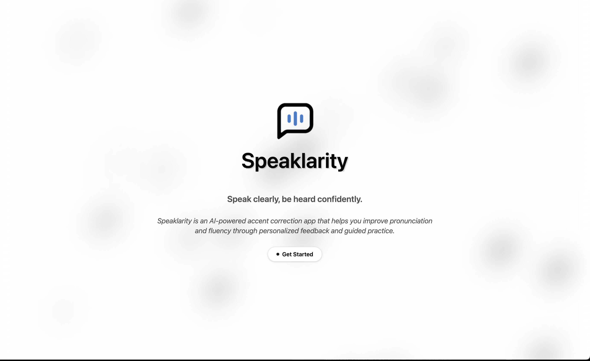
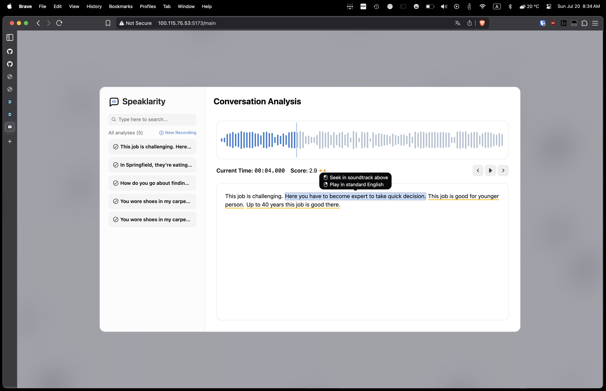

# SPEAKLARITY

**SPEAKLARITY** is a cutting-edge AI platform for accent correction and grammar analysis, leveraging advanced speech and language models for precise, actionable feedback. The system's accent check feature utilizes OpenAI's Whisper model for robust audio-to-text alignment, then extracts word-level embeddings using Microsoft's WavLM (see [WavLM: Large-Scale Self-Supervised Pre-Training for Full Stack Speech Processing](https://arxiv.org/abs/2110.13900)). By comparing user speech embeddings to native references, Speaklarity delivers detailed, word-by-word pronunciation scoring and alignment. To help users correct their accent, the platform uses gTTS to generate native-like audio for each word or sentence after prediction, enabling direct auditory feedback and practice. For grammar analysis, each sentence is evaluated using Google's Gemini API, providing context-aware corrections and linguistic feedback. This multi-model approach—acoustic alignment with Whisper and WavLM for pronunciation, gTTS for generative correction, and Gemini-powered grammar checking—enables comprehensive, real-time assessment for language learners and professionals. For more on the underlying models, see [Whisper: Robust Speech Recognition via Large-Scale Weak Supervision](https://arxiv.org/abs/2212.04356) and [WavLM](https://arxiv.org/abs/2110.13900).




## Conversation Analysis




## Features

- **Real-time Audio Recording & Analysis** – Capture and review daily conversations directly in your browser, enabling users to reflect on and improve their spoken communication habits.
- **Advanced Accent Correction** – Local, privacy-preserving accent analysis powered by word-by-word vector embeddings (WavLM + Whisper), delivering high-confidence, granular feedback on pronunciation accuracy.
- **Grammar Checking** – Automated grammar review of daily speech using state-of-the-art language models, helping users identify and correct common mistakes in real-world conversations.
- **Interactive Feedback & TTS Correction** – Receive actionable feedback and listen to AI-generated, accent-corrected speech for each word or sentence, making it easy to practice and improve.
- **Modern Web App & Progress Tracking** – A beautiful, responsive interface designed for ongoing improvement, with analytics and history to monitor your progress over time.

## Installation

(Developed on macOS Sequoia 15.5, Python 3.12 environment, Node.js 18+)

1. Clone the repository:

    ```bash
    git clone https://github.com/zangjiucheng/Speaklarity.git
    cd Speaklarity
    ```

2. Backend Setup:

    ```bash
    cd backend

    # Create and activate virtual environment
    python -m venv venv
    # Windows:
    venv\Scripts\activate
    # macOS/Linux:
    source venv/bin/activate

    # Install Python dependencies
    pip install -r requirements.txt

    # Set environment variables in .env file
    # Copy .env.example to .env and fill in your API keys
    cp .env.example .env

    # Fill in your API keys in .env file
    GEMINI_API_KEY="your_gemini_api_key"

    # Install FFmpeg (required for audio processing)
    # Windows (using winget):
    winget install ffmpeg
    # Or download from https://ffmpeg.org/download.html
    ```

3. Frontend Setup:

    ```bash
    cd frontend

    # Install Node.js dependencies
    npm install
    ```

## Usage

### Running the Application

1. **Start the Backend server:**

    ```bash
    cd backend
    python -m route
    ```

2. **Start the Frontend development server:**

    ```bash
    cd frontend
    npm run dev
    ```

3. **Access the web application** at `http://localhost:5173`

## API Endpoints

- `POST /upload-conversation`: Upload a `.wav` audio file for accent and grammar analysis. Returns metadata and starts processing in the background.
- `GET /list-audio`: List all uploaded conversations with their status and summary.
- `DELETE /delete-conversation/<id>`: Delete a conversation and all its associated files by ID.
- `GET /download-conversation/<id>`: Download the original audio file for a conversation by ID.
- `GET /conv/<id>`: Retrieve metadata and processing status for a specific conversation.
- `GET /native-reference/<conv_id>/<sentence_id>`: Download the native reference audio for a specific sentence in a conversation. Returns a `.wav` file for direct listening or download.

## Technology Stack

**Frontend:**
- React 19 with TypeScript
- Vite (build tool)
- Tailwind CSS + HeroUI (styling)
- Framer Motion (animations)
- React Router (routing)

**Backend:**
- WavLM embeddings (PyTorch)
- Flask (Python web framework)
- Whisper Speech Recognition (Local deployment)
- Audio processing libraries (ffmpeg)
- Gemini API for grammar checking

**Tools:**
- FFmpeg (audio processing)
- yt-dlp (YouTube audio extraction)

## License

This project is licensed under the [MIT License](./LICENSE). See the LICENSE file for details.

## References & Acknowledgements

### Key Research References

- Radford, A., Kim, J. W., Xu, T., Brockman, G., McLeavey, C., & Sutskever, I. (2022). *Robust Speech Recognition via Large-Scale Weak Supervision*. arXiv preprint arXiv:2212.04356. [Read the paper](https://arxiv.org/abs/2212.04356)
- Chen, S., Wang, S., Zhao, Z., Wu, Y., & Chen, J. (2021). *WavLM: Large-Scale Self-Supervised Pre-Training for Full Stack Speech Processing*. arXiv preprint arXiv:2110.13900. [Read the paper](https://arxiv.org/abs/2110.13900)

### Third-Party Libraries

**Frontend:**
- [HeroUI](https://heroui.com/) - Modern React component library
- [Framer Motion](https://www.framer.com/motion/) - Animation library
- [React Hot Toast](https://react-hot-toast.com/) - Notification system

**Backend:**
- [Flask](https://flask.palletsprojects.com/) - Python web framework
- [Werkzeug](https://werkzeug.palletsprojects.com/) - WSGI utility library
- [gTTS](https://pypi.org/project/gTTS/) - Text-to-speech
- [librosa](https://librosa.org/) - Audio analysis
- [matplotlib](https://matplotlib.org/) - Visualization
- [onnxruntime](https://onnxruntime.ai/) - ONNX model inference
- [openai-whisper](https://github.com/openai/whisper) - Whisper speech recognition
- [torch](https://pytorch.org/) - PyTorch deep learning
- [whisper](https://github.com/openai/whisper) - Speech recognition
- [google-genai](https://github.com/google/generative-ai-python) - Gemini API for grammar checking
- [dotenv](https://pypi.org/project/python-dotenv/) - Environment variable management